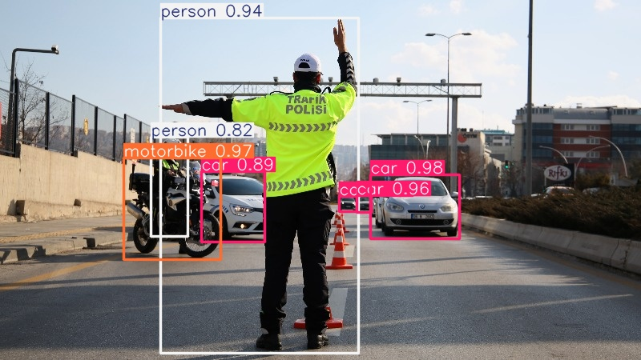

# 🛠️ COCO128 Object Detection using YOLOv11

This project showcases how to train and evaluate an object detection model on the lightweight COCO128 dataset using the powerful YOLOv5 framework in Google Colab.  
It is intended as a simple, easy-to-follow template for anyone interested in getting started with object detection.

---

## 📌 **Project Overview**
- **Framework:** [YOLOv11](https://github.com/ultralytics/yolov11)
- **Dataset:** COCO128 – a small subset of the COCO dataset (128 images)
- **Platform:** Google Colab – making it accessible to anyone without local GPU

The notebook covers:
✅ Dataset preparation  
✅ Model configuration  
✅ Training process  
✅ Visualizing predictions and evaluating results

---

## 🚀 **How to Use**
1. Clone the repository:
   ```bash
   git clone https://github.com/your-username/coco128-object-detection.git
2. Open the notebook in Google Colab: coco128_object_detection.ipynb -->
[](https://colab.research.google.com/github/username/repo-name/blob/main/coco128_object_detection.ipynb)

3. Run the cells step by step to train and test your model.

   📊 Expected Results
Quick training on COCO128 (few minutes on Colab GPU)

Detection of common object classes like person, bicycle, car, etc.

Baseline model that you can fine-tune on your own custom dataset
## 📊 Example Result



Train on a larger dataset for better accuracy

Experiment with different YOLOv11 variants (small, medium, large)

Deploy the trained model in a web or mobile app

✏️ Author
Mohammed
Computer Engineering graduate from Iğdır University
Passionate about AI, deep learning, and creative coding

⭐ Feel free to fork, use, and contribute!
